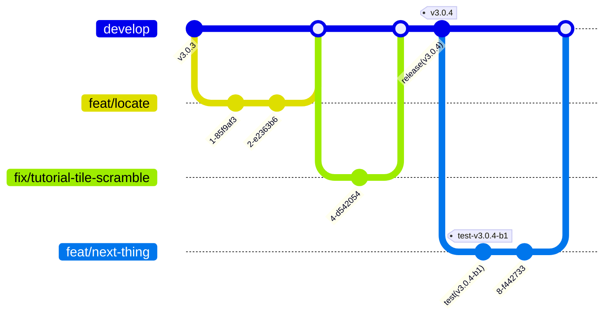

# Development workflow

How changes get from an idea into a released build. This is the **core team
runbook**.

If you're an outside contributor, start with
[CONTRIBUTING.md](../CONTRIBUTING.md) — it covers forking, what we accept, and
how to open a PR. Most of this page still applies to you, but you don't need the
release sections.

---

## Branching model

Single trunk. **`develop` is the default and only long-lived branch** — there is
no `main`, no `master` and no release branch. Work happens on short-lived
branches off `develop`; releases are cut by pushing a tag.

PRs land as **merge commits** (`Merge pull request #N from mapswipe/<branch>`) —
that is what every PR in this repository has used. A branch's own commits are
kept as-is on `develop`; nothing is collapsed.



Note the two kinds of tag. `v3.0.4` on `develop` is a **production** release.
`test-v3.0.4-b1` on a feature branch is a **test** release — a staging build for
trying something on a device, with no path to production. Both are produced by
`./deploy.sh`; see [deployment.md](deployment.md).

### Branch naming

A conventional-commit type, a slash, and a short kebab-case description. That is
what the history uses — `feat/` and `fix/` cover most branches, then `chore/` and
`docs/`:

```
feat/add-profile-page
fix/tutorial-tile-scramble
chore/add-lint-typecheck
docs/add-contributing-md
```

A couple of early branches use a dash instead of the slash
(`feat-changelog-modal`, `fix-reported-issues`), and there is one `temp/` branch.
Those are strays, not precedent.

One branch per ticket. Two unrelated changes means two branches and two PRs; a
reviewer should be able to hold the whole thing in their head.

### Commit messages

[Conventional commits](https://www.conventionalcommits.org/), optionally scoped:

```
feat: add private projects fetch
fix(tutorial): use taskId_real for ordering tutorial tasks
chore(build): updated build number
docs: add CONTRIBUTING.md
```

`release(vX.Y.Z):` and `test(vX.Y.Z-bN):` are reserved — `deploy.sh` generates
them. Don't write them by hand.

---

## The loop

1. **Start from a current `develop`.**

   ```sh
   git switch develop
   git pull
   git submodule update --init      # if backend/ or firebase/ moved
   git switch -c feat/my-thing
   ```

2. **Work.** See [architecture.md](architecture.md) for how the code is laid out.
   If you add or change any user-facing text, it has to be translatable — see
   [translating.md](translating.md).

3. **Check before pushing.** There is no test suite; static checks are all we
   have, so treat them as non-negotiable:

   ```sh
   pnpm check        # typecheck + lint
   pnpm lint:unused  # knip
   ```

   These are exactly what CI runs. If anything touched native code or native
   dependencies, also rebuild the app on a device — CI does not build on PRs.

4. **Open a PR against `develop`.** Describe what changed and how you verified
   it. Link the issue. Screenshots or a screen recording for anything visual —
   most of this app is visual.

5. **Review.** At least one approval before merge. Reviewers: pull the branch and
   run it if the change touches mapping, auth or the map rendering; those are the
   areas where "looks right in the diff" is least reliable.

6. **Merge.** GitHub's **“Merge pull request”** — a merge commit, which is what
   every PR here has used. Squash and rebase merging are both enabled on the
   repository but unused; don't be the first without a reason. Delete the branch
   afterwards.

7. **Release** when `develop` is in a state you're happy to ship — see below.

### Keeping a branch current

Rebase onto `develop` rather than merging it in, so the branch stays a clean
sequence of your own commits:

```sh
git fetch origin
git rebase origin/develop
```

---

## Testing a change on a real device

Two options, and picking the right one saves time:

- **Local build** — fastest iteration, and what you should be doing while you
  work. `pnpm android` / `pnpm ios`. For release-mode behaviour (performance,
  minification), see [dev-release.md](dev-release.md).
- **Test release** — when someone *else* needs to try it, or you need a properly
  signed build. Run `./deploy.sh`, choose **test**, and CI publishes a signed
  staging APK as a GitHub pre-release plus an iOS IPA artifact.

Test releases work from any branch and never touch production. They commit a
build-number bump (`test(vX.Y.Z-bN): …`) to your branch, and because branches are
merged rather than squashed, those commits arrive on `develop` with the merge.
That's harmless for the build number — the next production release sets version
and build explicitly — but keep test releases to build-number-only bumps, because
a leaked **version** change is not. Full detail in
[deployment.md](deployment.md#test-releases).

Still prefer a **feature branch** over `develop` for test builds: run from
`develop`, `deploy.sh` commits and pushes straight to trunk, unreviewed.

---

## Cutting a production release

Full procedure in [deployment.md](deployment.md). In outline:

1. `develop` is green, up to date with `origin`, and has everything you intend to
   ship.
2. Merge any pending Transifex translation PRs first — see
   [translating.md](translating.md). Translations that land after the tag miss
   the release.
3. Run `./deploy.sh`, choose **production**. It asks for the version, build
   number, description, and opens your `$EDITOR` for the in-app changelog
   bullets. It then bumps the version files, writes `changeLog.json`, commits,
   tags `vX.Y.Z` and pushes.
4. The tag triggers Android and iOS workflows in parallel. Each builds a
   **staging** artifact automatically, then waits for **manual approval** before
   building production.
5. Test the staging build. Then approve the production stage in the Actions tab —
   separately for each platform.
6. The iOS IPA is a workflow artifact; upload it to App Store Connect by hand.

### Version numbering

[Semantic versioning](https://semver.org/), `X.Y.Z`, with a separate build
number. `deploy.sh` keeps `package.json`, `app.staging.json` and `app.prod.json`
in sync and derives `android.versionCode` from the two.

The build number exists because Apple lets you upload a new build of the *same*
version without a fresh review — so bump the build number for iterative test
builds, and the version for actual releases. `deploy.sh` warns if a test release
would change the version, because that bump reaches `develop` as soon as the
branch is merged.

---

## What CI does

| Trigger | Workflow | Result |
| --- | --- | --- |
| Pull request | [`ci.yml`](../.github/workflows/ci.yml) | Lint, typecheck, unused-code check. No build. |
| `v*.*.*` tag | [`release-android.yml`](../.github/workflows/release-android.yml), [`release-ios.yml`](../.github/workflows/release-ios.yml) | Staging build → manual approval → production build. |
| `test-*` tag | [`test-android.yml`](../.github/workflows/test-android.yml), [`test-ios.yml`](../.github/workflows/test-ios.yml) | Staging build only. |

> ⚠️ `ci.yml`'s `push` trigger currently lists the branches `dev` and `main`,
> neither of which exists in this repository. In practice checks only run on
> **pull requests** — a direct push to `develop` runs nothing. Worth fixing;
> until then, don't rely on post-merge CI catching anything.

---

## See also

- [CONTRIBUTING.md](../CONTRIBUTING.md) — for outside contributors
- [architecture.md](architecture.md) — how the code is organised
- [deployment.md](deployment.md) — the full release procedure
- [translating.md](translating.md) — adding user-facing text
- [develop-android.md](develop-android.md) / [develop-ios.md](develop-ios.md) — environment setup
